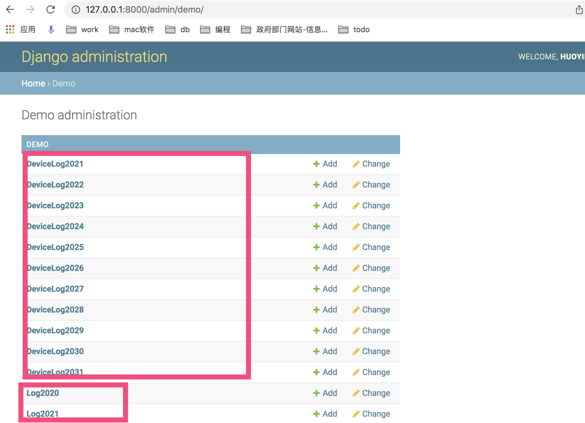

Django分表示例
=======================

**Django中横向分表的一个简单实现，支持基于固定分片数量的分表和基于年、月、日的日期分表**

源由
-----
无意中看了知乎的一个问答【Django分表如何实现】，之前也遇到过横向分表的需求，当时采用的是数据库的表分区来实现的，这种方式对业务代码透明，无需任何改动。看到有人提出了代码实现这个问题，总结了知友们的回答和做了些简单包装，写了这个demo，增加按日期分表和自动数据库migration迁移功能，和分表的分页功能，欢迎大神们查漏补缺。

实现
-----
定义了一个`ShardingMixin`(详见`apps.base.model_sharding.py`)混入类，继承了该混入类的抽象模型类可调用类方法`shard`，根据传入的值来获取对应分表的模型类实例来进行ORM操作，如：`models.User.shard(0).objects.create(name='iTraceur', age=18)`，`models.Log.shard(202001).objects.create(content='test log')`。
django启动前，需手动执行一次migration创建初始数库表，django启动后，当分表模型不存在时会自动创建和自动做数据库migration迁移，无需手动执行迁移和创建数据库表。

通用settings
-----
* `SHARDING_COUNT_DEFAULT`固定数量分表的通用数量，默认为`10`
* `SHARDING_DATE_START_DEFAULT`日期分表的通用开始日期，默认为`2020-01-01`
* `SHARDING_DATE_FORMAT_DEFAULT`日期分表的通用表名日期后缀格式，如：`%Y`、`%Y%m`、`%Y%m%d`，默认为`%Y%m`按月分表

```


基于日期的分表(适用于日志记录这种随时间增长的场景)
-----
* 定义模型时需设置类属性`SHARDING_TYPE＝'date'`
* 如需单独对某个模型设置分表开始日期，可在定义模型时设置`SHARDING_DATE_START`类属性为对应的日期
* 如需单独对某个模型设置分表的表名后缀格式，可在定义模型时设置`SHARDING_DATE_FORMAT`类属性来控制按年、按月、按日进行分表，分别为：`%Y`、`%Y%m`、`%Y%m%d`。


```python
class Log(models.Model, model_sharding.ShardingMixin):
    level = models.PositiveSmallIntegerField(default=0)
    content = models.TextField()
    time = models.DateTimeField(auto_now_add=True)

    # Date-based sharding
    SHARDING_TYPE = 'date'
    SHARDING_DATE_START = '2020-03-01'
    SHARDING_DATE_FORMAT = '%Y%m'

    class Meta:
        abstract = True
        db_table = "log_"

# 分表模型类初始化
def init_log_models():
    admin_opts = {
        'list_display': ('id', 'time', 'level', 'content')
    }
    model_sharding.register_admin_opts(Log._meta.label_lower, admin_opts)

    for sharding in Log.get_sharding_list():
        model_sharding.create_model(Log, sharding)

init_log_models()
```


```shell
(venv) ➜  django_table_sharding_example git:(master) python manage.py shell_plus
{'demo_device_log_2021': <class 'apps.demo.models.DeviceLog2021'>,
 'demo_device_log_2022': <class 'apps.demo.models.DeviceLog2022'>,
 'demo_device_log_2023': <class 'apps.demo.models.DeviceLog2023'>,
 'demo_device_log_2024': <class 'apps.demo.models.DeviceLog2024'>,
 'demo_device_log_2025': <class 'apps.demo.models.DeviceLog2025'>,
 'demo_device_log_2026': <class 'apps.demo.models.DeviceLog2026'>,
 'demo_device_log_2027': <class 'apps.demo.models.DeviceLog2027'>,
 'demo_device_log_2028': <class 'apps.demo.models.DeviceLog2028'>,
 'demo_device_log_2029': <class 'apps.demo.models.DeviceLog2029'>,
 'demo_device_log_2030': <class 'apps.demo.models.DeviceLog2030'>,
 'demo_device_log_2031': <class 'apps.demo.models.DeviceLog2031'>,
 'demo_log_2020': <class 'apps.demo.models.Log2020'>,
 'demo_log_2021': <class 'apps.demo.models.Log2021'>,
 'demo_user_0': <class 'apps.demo.models.User0'>,
 'demo_user_1': <class 'apps.demo.models.User1'>,
 'demo_user_2': <class 'apps.demo.models.User2'>,
 'demo_user_3': <class 'apps.demo.models.User3'>,
 'demo_user_4': <class 'apps.demo.models.User4'>,
 'demo_user_5': <class 'apps.demo.models.User5'>,
 'demo_user_6': <class 'apps.demo.models.User6'>,
 'demo_user_7': <class 'apps.demo.models.User7'>,
 'demo_user_8': <class 'apps.demo.models.User8'>,
 'demo_user_9': <class 'apps.demo.models.User9'>}
# Shell Plus Model Imports
from apps.demo.models import DeviceLog2021, DeviceLog2022, DeviceLog2023, DeviceLog2024, DeviceLog2025, DeviceLog2026, DeviceLog2027, DeviceLog2028, DeviceLog2029, DeviceLog2030, DeviceLog2031, Log2020, Log2021, User0, User1, User2, User3, User4, User5, User6, User7, User8, User9
from django.contrib.admin.models import LogEntry
from django.contrib.auth.models import Group, Permission, User
from django.contrib.contenttypes.models import ContentType
from django.contrib.sessions.models import Session
# Shell Plus Django Imports
from django.core.cache import cache
from django.conf import settings
from django.contrib.auth import get_user_model
from django.db import transaction
from django.db.models import Avg, Case, Count, F, Max, Min, Prefetch, Q, Sum, When
from django.utils import timezone
from django.urls import reverse
from django.db.models import Exists, OuterRef, Subquery
Python 3.7.4 (default, Sep 14 2021, 17:28:29) 
[Clang 10.0.0 (clang-1000.10.44.4)] on darwin
Type "help", "copyright", "credits" or "license" for more information.
(InteractiveConsole)
>>> from apps.demo.models import *
>>> DeviceLog.shard('2021')
<class 'apps.demo.models.DeviceLog2021'>
>>> DeviceLog.shard('2021').objects.all()
<QuerySet [<DeviceLog2021: 1>]>
>>> 

```

Links
-----
* [[知乎问答] Django 分表 怎么实现？](https://www.zhihu.com/question/43310457)


* [多个数据库](https://www.codeleading.com/article/95571343611/)


## admin

